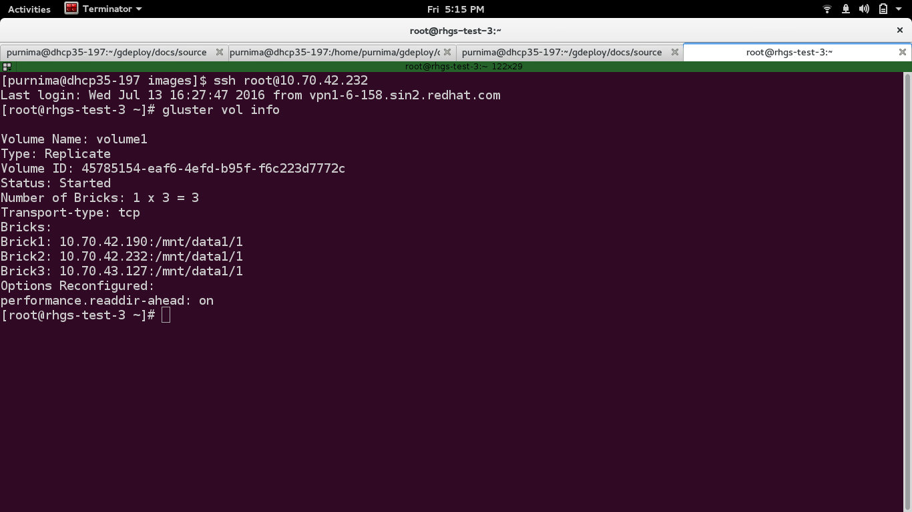
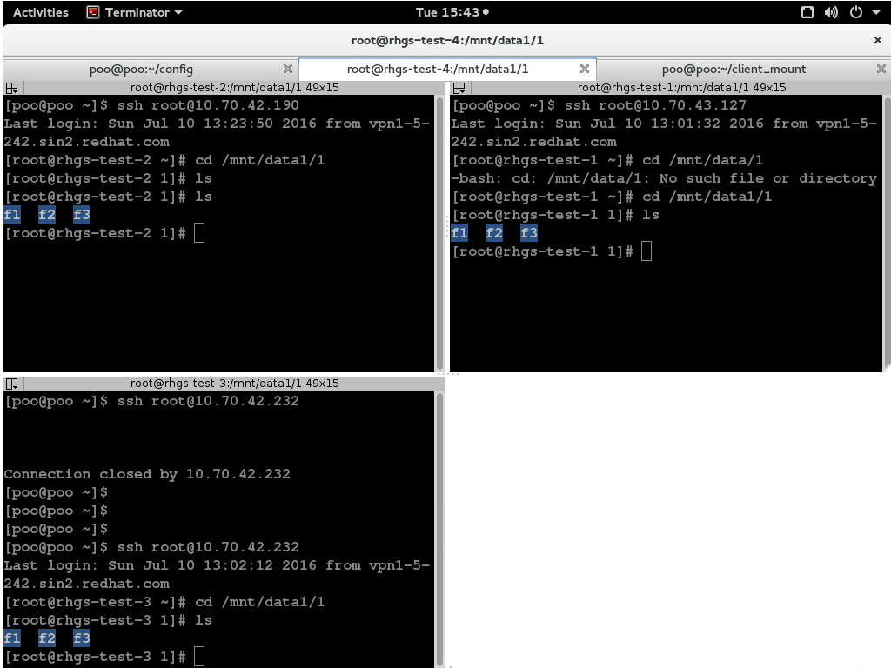

Using gdeploy to create a 1x3 Gluster Volume
--------------------------------------------
To create 1*3 gluster volume we would need three bricks which may or may not
be on the same machine. It is recommended that these three bricks reside on
different machines.

**Step 1:**

Create the following configuration file::

    [hosts]
    10.70.43.127
    10.70.42.190
    10.70.42.232

    [backend-setup]
    devices=/dev/vdb
    vgs=1_3_gluster
    pools=pool1
    lvs=lv2
    mountpoints=/mnt/data1
    brick_dirs=/mnt/data1/1

    [peer]
    manage=probe

    [volume]
    action=create
    volname=volume1
    replica=yes
    replica_count=3
    force=yes

    [clients]
    action=mount
    volname=volume1
    hosts=192.168.122.19
    fstype=glusterfs
    client_mount_points=/mnt/client_mount

**Step 2:**

Save the file by giving it some name e.g. '1_3_volume.conf'. 
Invoke gdeploy and run the file using::

   $gdeploy -c 1_3_volume.conf

**Step 3:**

Check whether a gluster volume has been created by running the below command::

   $gluster vol info

   
**Step 4:**

Now you can start writing to the volume using your client machine (192.168.122.19 in our case) by traversing to the
path you have mentioned under "client_mount" using the following command::

   $ sudo touch f1 f2 f3

This command will create three files under the directory /mnt/client_mount

You can also check whether the files have been created and replicated thrice inside the directory ``/mnt/data1/1`` on the remote nodes by running the command::

   $ ls

We can see that the files have been successfully replicated on all the three nodes.

