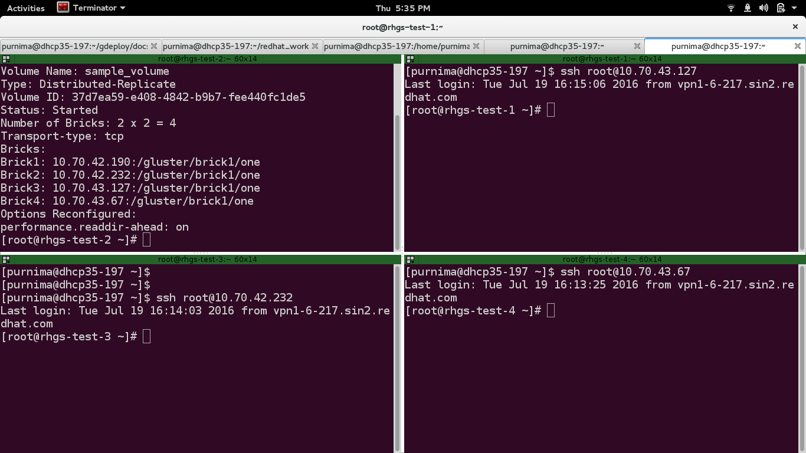
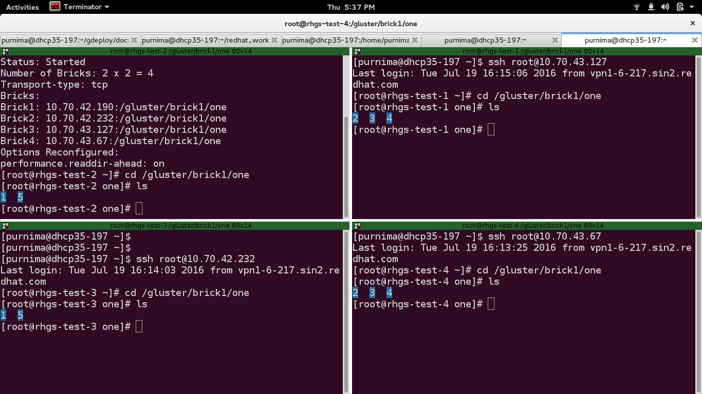

Using gdeploy to create 2x2 gluster volume
==========================================

To create 2x2 gluster volume, you would need four bricks which may or may not be on the same machine.
It is recommended that that these four bricks reside on different machines.

**Step 1:**

 Create the following configuration file::

   [hosts]
   10.70.43.127
   10.70.42.190
   10.70.42.232
   10.70.43.67

   [backend-setup]
   devices=/dev/vdb
   mountpoints=/gluster/brick1
   brick_dirs=/gluster/brick1/one

   [volume]
   action=create
   volname=sample_volume
   replica=yes
   replica_count=2
   force=yes

   [clients]
   action=mount
   hosts=192.168.122.19
   fstype=glusterfs
   client_mount_points=/home/poo/random_client

**Step 2:**

Save the file by giving it some name e.g. '2x2-gluster-volume.conf'.
Invoke gdeploy and run the file using::
   
    $ gdeploy -c 2x2-gluster-volume.conf

**Step 3:**

To check whether a gluster volume has been created by running the below command::

    $ gluster vol info

**Step 3:**

Now you can start writing to the volume using your client machine (192.168.122.19 in our case) by traversing to the
path you have mentioned under "random_client" using the following command::

    $ sudo touch 1 2 3 4 5

This command will create five files under the directory /home/poo/random_client.

You can also check whether the files have been created and replicated thrice
inside the directory ``/gluster/brick1/one`` on the remote nodes by running the
command::

    $ ls

We can see that the files have been successfully replicated on all the four nodes.

