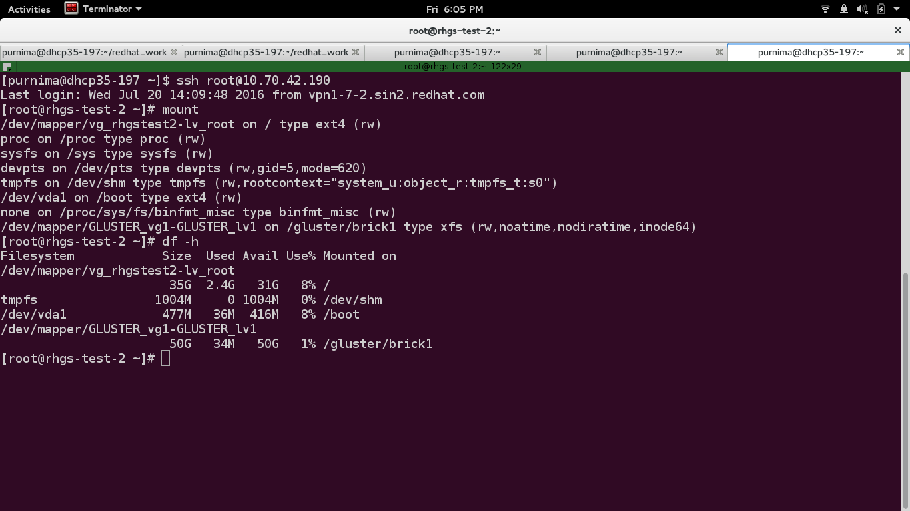
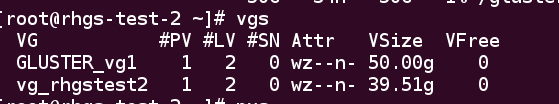
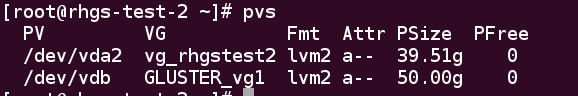
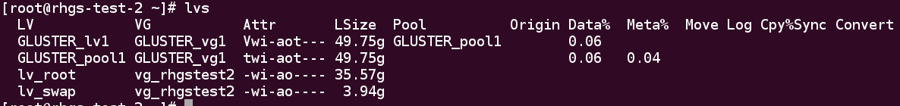

Write a config file to do the backend setup
===========================================

[backend-setup] section is used configure the disks on all the hosts
mentioned in the [hosts] section. If the disks names varies from host to
host then [backend-setup:<hostname>/<ip>] can be used to do setup
backend on the particular host.

**Step 1:**

Create an empty file and give it a any arbitrary name and save it with a
``.conf`` extension at the end of the file. Add the following lines to it::

   # This is a mandatory section, and hostnames/ip-address are listed one per line.

   [hosts]
   10.70.43.127
   10.70.42.190
   10.70.42.232
   10.70.43.67

   # Backend setup for all the hosts listed inside [hosts] section

   [backend-setup]
   devices=/dev/vdb
   mountpoints=/gluster/brick1
   brick_dirs=/gluster/brick1/one

   # Backend setup for 10.70.46.77 with default gdeploy generated names for
   # Volume Groups and Logical Volumes. Volume names will be GLUSTER_vg1,
   # GLUSTER_vg2...
   #
   # [backend-setup:10.70.43.127]
   # devices=vdb

   # Backend setup for remaining 3 hosts in the `hosts' section with custom names
   # for Volumes Groups and Logical Volumes.
   #
   # [backend-setup:10.70.46.{130,32,110}]
   # devices=vdb,vdc,vdd
   # vgs=vg1,vg2,vg3
   # pools=pool1,pool2,pool3
   # lvs=lv1,lv2,lv3
   # mountpoints=/mnt/data1,/mnt/data2,/mnt/data3                                                      
   # brick_dirs=/mnt/data1/1,/mnt/data2/2,/mnt/data3/3

**Step 2:**

Invoke gdeploy and run the file using::
   
   $ gdeploy -c backend-setup.conf

**Step 3:**

To see if the GLUSTER_vg1 (which is the default name for gluster volume group)
has been mounted on the desired directory or not. You can either run ``mount``
or ``df -h``::

   $ mount
   
You'll see something like this.

To see volume groups a.k.a vgs, run the following command::

  $ vgs

To check physical volume, run the following command::

  $ pvs

And to check logical volume, run the following command::

  $ lvs

We can see that volume groups and logical volumes has been successfully created.
