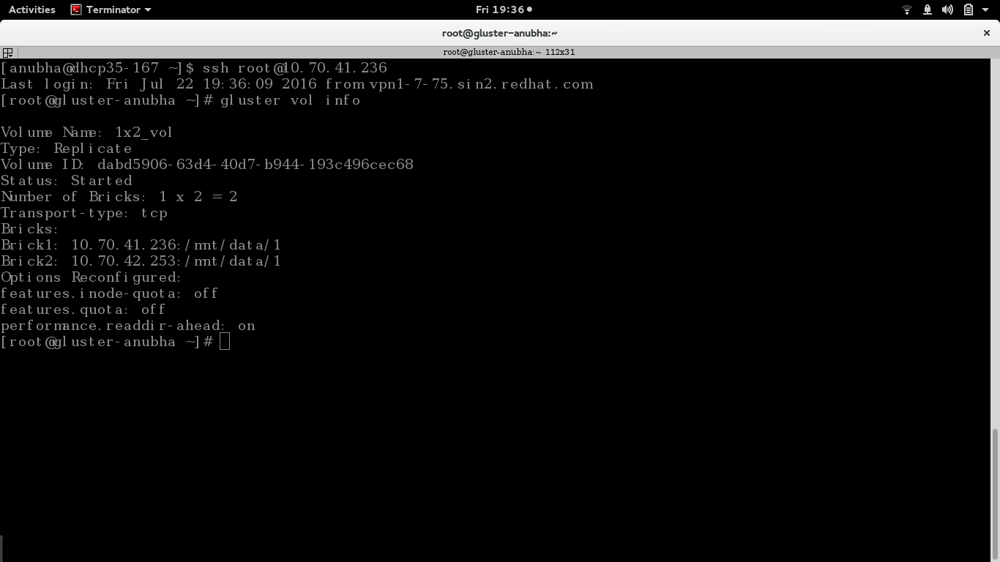

Enabling and disabling quota
============================

This document is intended to demonstrate how one can enable and disable quota on a Gluster volume.

**Step 1:**

Create a '.conf' file with the following contents::

	[quota]
	action=enable
	volname=10.70.41.236:1x2_vol

Here, '1x2_vol' is the name of our volume and 10.70.41.236 is one of the hosts / nodes in the cluster. 

We'll name this file 'enable_quota.conf'.

**Step 2:**

Run this using::

	gdeploy -c enable_quota.conf

**Step 3:**

You can check whether quota has been enabled by checking volume info using::

	$gluster vol info

This command can be run on any of the machines on which the volume resides.

We can see that quota has been enabled on this volume.

One may follow the following steps to disable quota on this volume.

**Step 1:**

Create a '.conf' file with the following contents::

        [quota]
        action=disable
        volname=10.70.41.236:1x2_vol

Here, '1x2_vol' is the name of our volume and 10.70.41.236 is one of the hosts / nodes in the cluster.

We'll name this file 'disable_quota.conf'.

**Step 2:**

Run this using::

        gdeploy -c disable_quota.conf

**Step 3:**

You can check whether quota has been disabled by checking volume info using::

        $gluster vol info

This command can be run on any of the machines on which the volume resides.

