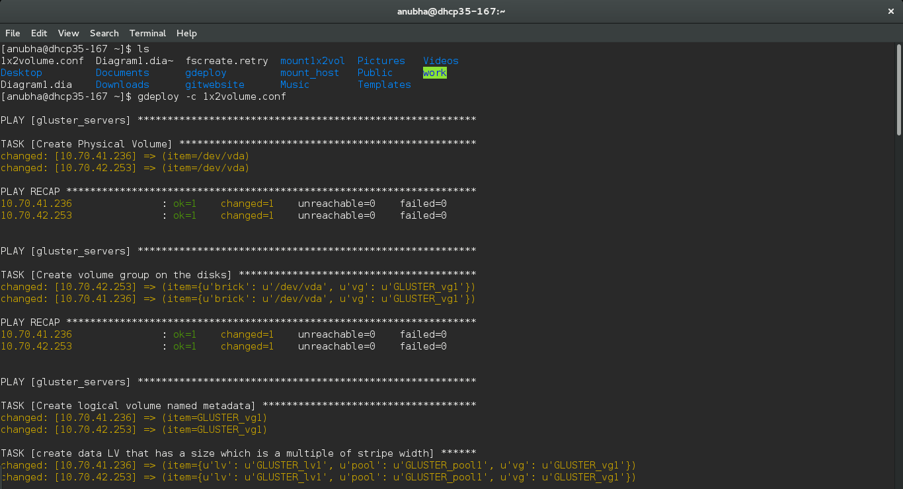
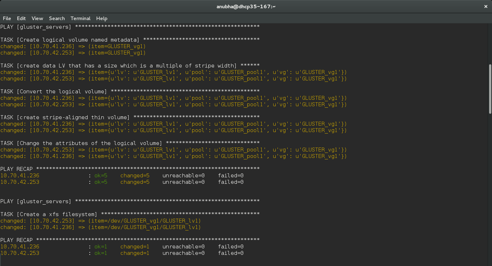
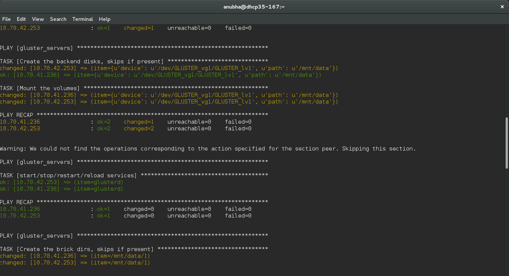
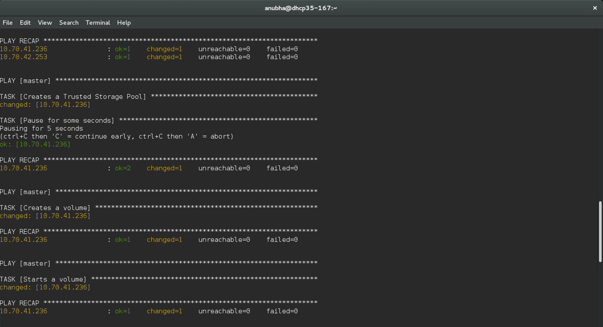
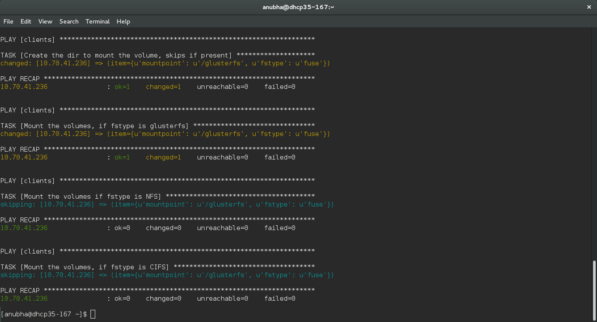
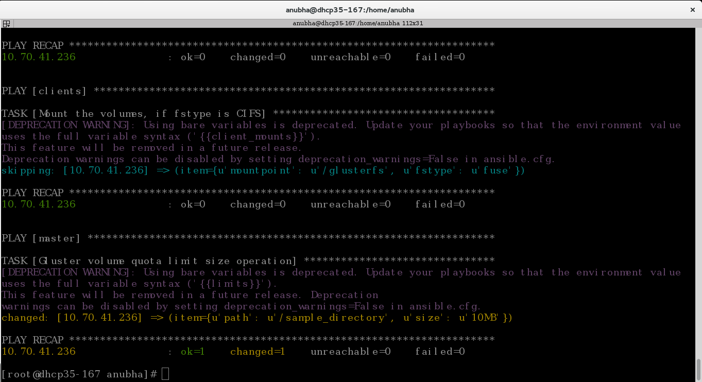
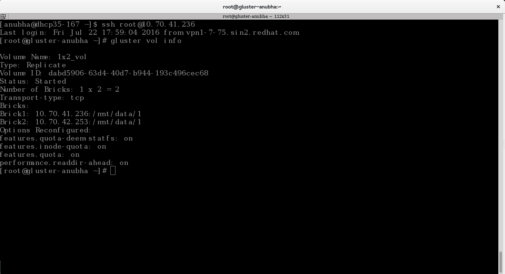
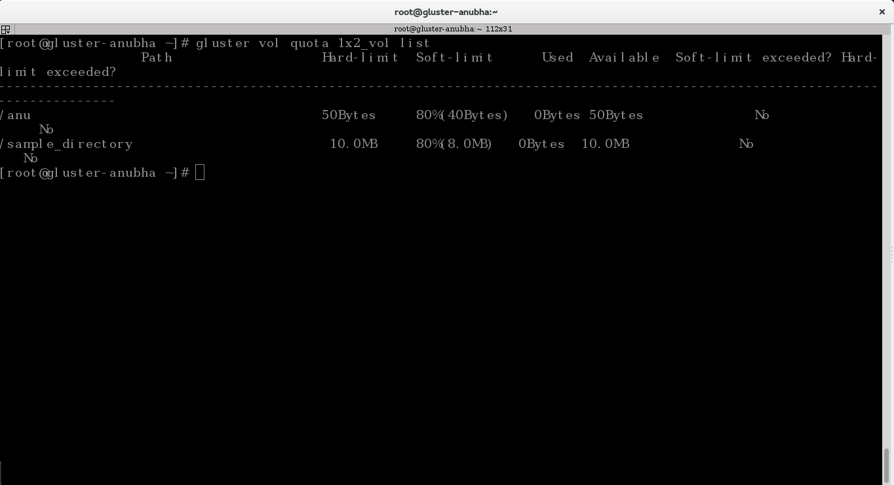

Create a Gluster volume and set up quota
========================================

Here, we will see how we can create a 1x2 replica volume and then set a size limit on one of the directories within it. A 1x2 replica volume means that we would need 2 bricks and each file will have 2 replicas, one on each brick. 

As a recommended practice, our bricks reside on separate machines. We have used two VMs for our two bricks in our case, and these have IPs 10.70.41.236 and 10.70.42.253.

**Step 1:**

Create an empty '.conf' file e.g. '1x2volume.conf' on the machine where you have gdeploy installed and add the following lines to it::

	# This does backend setup first and then creates the volume using the
	# setup bricks.

	[hosts]
	10.70.41.236
	10.70.42.253

	# Common backend setup for 2 of the hosts.
	[backend-setup]
	devices=vda
	mountpoints=/mnt/data
	brick_dirs=/mnt/data/1

	# If backend-setup is different for each host
	# [backend-setup:192.168.122.109]
	# devices=sdb
	# brick_dirs=/gluster/brick/brick1
	#
	# [backend-setup:192.168.122.227]
	# devices=sda,sdb,sdc
	# brick_dirs=/gluster/brick/brick{1,2,3}
	#
	[peer]
	manage=probe

	[volume]
	action=create
	volname=1x2_vol
	replica=yes
	replica_count=2
	force=yes

	[clients]
	action=mount
	volname=1x2_vol
	hosts=10.70.41.236
	fstype=glusterfs
	client_mount_points=/glusterfs

	#Enabling quota for this volume
	[quota]
	action=enable
	volname=10.70.41.236:1x2_vol

	# This will set up a quota limit for the specified path on the volume
	[quota]
	action=limit-usage
	volname=10.70.41.236:1x2_vol
	path=/sample_directory
	size=10MB

path refers to a directory on the client mount point i.e. a directory inside /glusterfs in our case. We created a directory named "sample_directory" inside "/glusterfs" on our client machine 10.70.41.236 using the "mkdir" command. We are setting a size limit on this directory. 

**Step 2:**

Invoke gdeploy and run the file using::

	$gdeploy -c 1x2volume.conf

'1x2volume.conf' is the name of our configuration file.

|

|

|

|

|

**Step 3:**

You can check whether a gluster volume is created by running the following command on any or all of the nodes::

	$gluster vol info

Here, we can also see that quota has been enabled.

**Step 4:**

Let's check whether the size limit for our directory "sample_directory" has been set. 
One can check quota attributes on a volume using the command::

	$gluster vol quota 1x2_vol list

Here, 1x2_vol is the name of our volume.

**Step 5:**

You can test the volume by creating a file and see whether it is getting replicated. On your client machine (10.70.41.236 in our case), traverse to the path you have mentioned under "client_mount_points" (e.g. 'cd /glusterfs') and create a file using the following command::

	$touch sample.txt

This command will create a file named as "sample.txt" under the directory "/glusterfs". You may create this file on any of the directories under "/glusterfs",we have created it in the topmost one.

You can check whether the file has been replicated twice by traversing to the path "/mnt/data1/1" on both the nodes and running the command::

	$ls

You will see two copies of your file in total, on the bricks. 

You have successfully setup a 1x2 Gluster volume using gdeploy and set a size limit on one of the directories on it.

