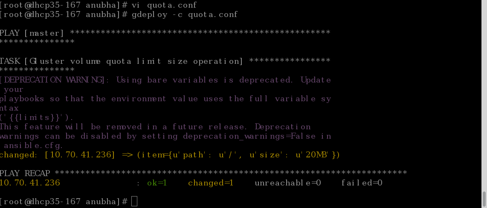
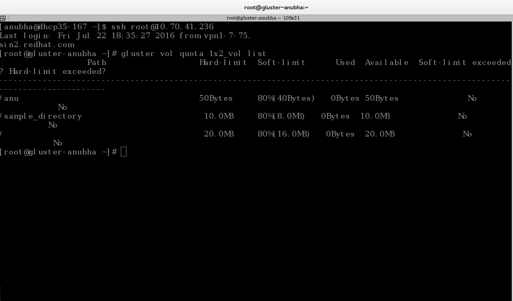

Quota setup on an existing volume
=================================

Here, we will be setting up quota on an existing volume.

**Step 1:**

Create an empty '.conf' file e.g. 'quota.conf' and add the following to it::

	#
	# Usage:
	#       gdeploy -c quota.conf
	#
	# This config enables and sets up quota limit for the specified volume
	#

	[quota]
	action=enable
	volname=10.70.41.236:1x2_vol

	#You can skip the above if quota is already enabled on the volume

	[quota]
	action=limit-usage
	volname=10.70.41.236:1x2_vol
	path=/
	size=20MB

'1x2_vol' is the name of our volume and 10.70.41.236 is one of the hosts / nodes in the cluster.

**Step 2:**

Run this file using the following command::

	$gdeploy -c quota.conf

**Step 3:**

You can check whether quota has been set using the command::

	$gluster vol quota 1x2_vol list

This command should be run on the machine where the volume exists. '1x2_vol' is the name of our volume.

