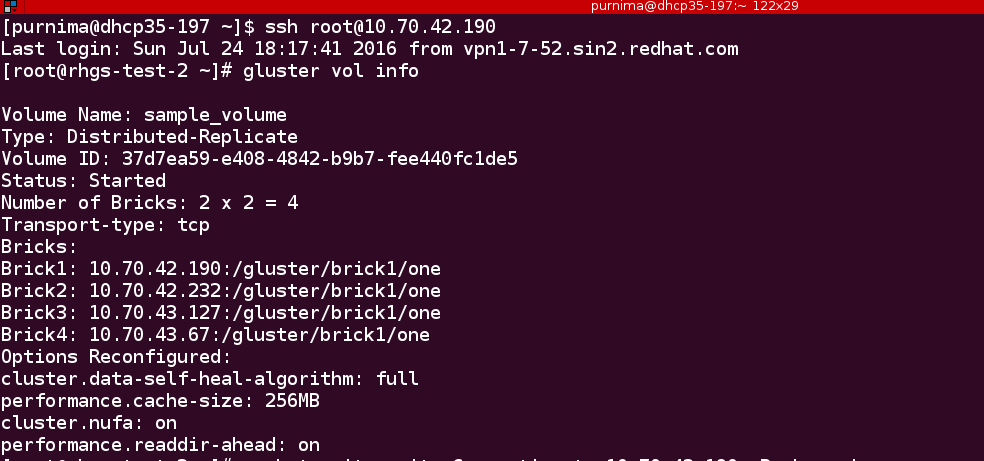

Set/unset volume options on an existing volume
==============================================

Often, we are required to customize our volume for different use cases. Setting
those options enhances performance and prepares the volume for our desired
task. In order to do so, we set different options on the volume using the 'key'
parameter in our configuration file.

This tutorial will take you through just that. It's intended to show you how
you can set different volume options on an existing Gluster volume. (To create
a Gluster volume, please refer to `1x3-gluster-volume <1x3-volume-create.html>`_
or `2x2-gluster-volume <2x2-volume-create.html>`_).

Setting the options on an existing volume
=========================================

**Step 1:**

Create an empty file and give it any arbitrary name. For the purpose of this
demonstration, let's call our file ``set_options_vol.conf``. Add the following
lines to your newly created config file::

   # The config file sets configuration options for the already existing volume.

   # A volume can be created and its volume options can be set at the time of creation.

   # The volume section takes key value pairs. The number of keys should match
   # the number of values.

   # 'action' option specifies what action id to be performed in the volume.
   # The choices are: [create, delete, add-brick, remove-brick, rebalance,
   # set].

   [volume]
   action=set
   volname=10.70.42.190:sample_volume
   key=cluster.nufa,performance.cache-size,cluster.data-self-heal-algorithm
   value=on,256MB,full

**Step 2:**

Invoke gdeploy and run the file using::

   $ gdeploy -c set_options_vol.conf

**Step 3:**

To verify if these options are indeed set on the volume, run the following command::

   $ gluster vol info
   

We can see that those options have been set on the volume.

Resetting the options on the existing volume
============================================

What if you want to reset or unset some options that you no longer require?
There is no ``unset`` option per se, but you can ``set`` them back to different
values to unset them.
This configuration will show you how to do it. Change the values in the value
parameter and the rest of it will be taken care of by gdeploy based on the
config file.

**Step 1:**

Let's call your reset configuration file ``reset_options_vol.conf``. Add the
following lines to reset _options_vol.conf::

  # This config resets options for the volume

  [volume]
  action=set
  volname=10.70.42.190:sample_volume
  key=cluster.nufa,features.lock-heal
  value=off,off

**Step 2:**

  Invoke gdeploy and run the following command::

   $ gdeploy -c reset_options_vol.conf

**Step 3:**

  To verify if options have been reset, run the following command::

  $ gluster vol info

You'll see that the desired settings have been applied on the volume.
