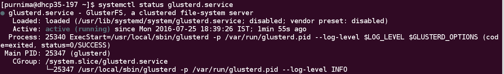
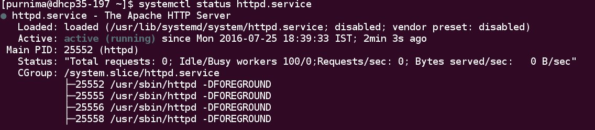

How to start and stop services
==============================

'service' section lets you start, stop, enable, disable, restart, or
reload services. Multiple service names can be provided as a comma
separated list as shown in configuration file below.

For a hands-on walkthrough of the process, let us take a look at how we can
start services such as glusterd, httpd, ntp through the config file.

Here, we'll learn how to start services such as glusterd, httpd, ntp through
config file.

**Step 1:**

Create an empty file and give it any arbitrary name. For the purpose of this demonstration,
let's call our file ``starting_services.conf``. Add the following lines to your
newly created config file::

  # This is a mandatory section, and hostnames/ip-address are listed one per line.
  # IP address for host shown here is for demonstration, don't forget to change it
  # to a valid IP address in your network.

  [hosts]
  10.209.69.106

  # To start services                                         

  [service]
  action=start
  service=glusterd,httpd

  # To stop services
  #
  # [service]
  # action=stop
  # service=glusterd,httpd

  # To disable services
  # 
  # [service]
  # action=disable
  # service=glusterd,httpd

  # To restart services
  #
  # [service]
  # action=restart
  # service=glusterd,httpd

  # To reload services
  #
  # [service]
  # action=reload
  # servcie=glusterd,httpd

**Step 2:**

Invoke gdeploy and run the file using::

   gdeploy -c starting_services.conf

**Step 3:**

To check the status of  ``glusterd`` service, run the following command::
  
   $ systemctl status glusterd.service

To check the status of ``httpd`` service, run the following command::

   $ systemctl status httpd.service

As we can see the ``gluster`` and ``httpd`` services has been started.
